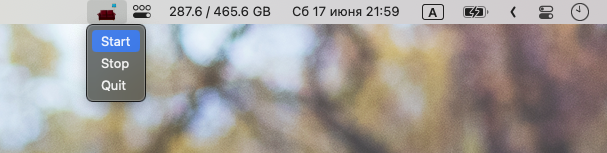
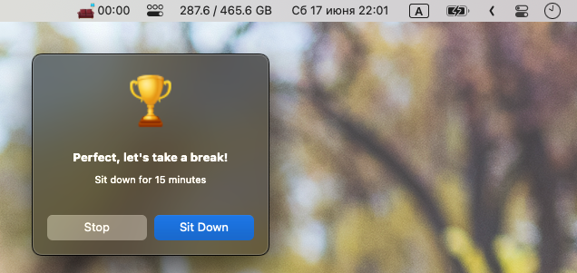
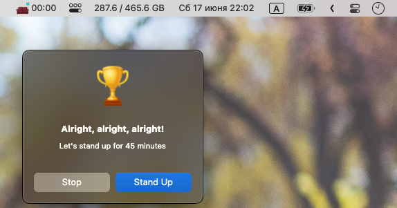

# StndApp – macOS Menubar App

Current release: [StndApp (Version 1.0)](https://github.com/WasAlexHere/stndApp/releases/tag/1.0.0)

Menubar app to control stand/sit routine. It will inform you when you need to sit or stand during your work day.
Just hit 'Start' button and pay attention to notifications.

Right now you can stand work for 45 minutes and sit for 15 minutes.

## How it works
- Hit 'Start' button.

- The standing routine is on now for n (45 minutes by default) minutes. The countdown timer is visible in menubar.

- Suddenly, you need to pause your timer and get a glass of water. Just hit 'Pause' button in the StndApp menu.

- You've finished with your sudden needs and ready to continue with standing work. Just hit the 'Start' button in the StndApp menu.
- Wow! The stand timer is finished, and you've got a message on you screen. Here you can stop your routine, or you can continue with your work while siting.

- The sit timer is finished, and you've got another message on you screen. Here you can stop your routine, or you can continue with your work while standing.

- Yes! It's so simple!

## Features
- Continuous alerts to stand up (for standing work) and sit down (for sitting work) during a work day.
- Start/Pause/Stop functionality.
- Displaying time for each routine with corresponding icon.

## Upcoming ideas
- Count for the amount of standing routines during a day (it should be less than 5!).
- Modification of sit/stand intervals.