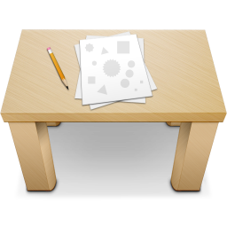

# StndApp – macOS Menubar App

Current release: [StndApp (Version 1.0.0)](https://github.com/WasAlexHere/stndApp/releases/tag/1.0.0)

Menubar app to control stand/sit routine. It will inform you when you need to sit or stand during your work day.
Just hit 'Start' button and pay attention to notifications. If you need to take a brake, just hit 'Pause' button and resume when you're ready.

Stand/Sit intervals are 30 and 30 minutes by default, but you can modify them by clicking 'Edit' button.

If you'ver reached the limit for standing work per a day, the app will tell you to take a rest and continue tomorrow.

## Features
- Continuous alerts to stand up (for standing work) and sit down (for sitting work) during a work day.
- Start/Pause/Stop functionality.
- Displaying time for each routine with corresponding icon.
- Modification of sit/stand intervals.
- Allow to stand for 4 hours a day.
- Support dark mode.
